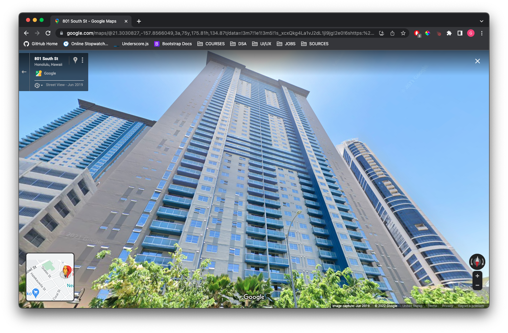
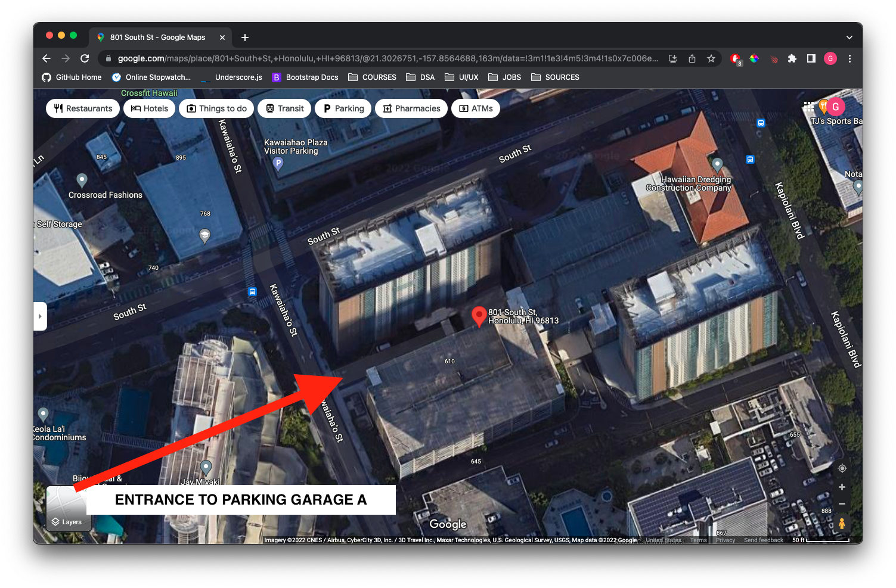

# Keyboards HI Meetup

# Venue - Meeting Room B @ 801 South Street, Honolulu, HI 96813

# Entrance for People Who Are Driving to the Event

## Parking Instructions
1. Collect ticket from dispenser at gate entry of Garage B
2. Attendees may only park in one of the 74 stalls numbered 925 - 932, 979 - 985, 1001 - 1035 or 1044 - 1067.
   1. __DO NOT park on the first floor, it is only for residential guests__
3. Take note of your license plate and stall number
4. Take the elevator to the ground level and sign in with security at the lobby
5. **Alert the security officer that you are attending a meeting room event in Meeting Room B**
6. A validation stamp will be provided that will allow you to exit the parking garage at no cost (up to 6 hours)
7. **Upon leaving, present the parking ticket to security. Do not insert it in the ticket collection machine**

#### OTHER IMPORTANT DETAILS: Meeting room event attendees that lose their ticket will be charged a lost ticket fee of $20.00 to exit the parking structure. Vehicles inappropriately parked within the garage may be towed immediately, without warning. If there is a parking need that exceeds the number of stalls available, there are metered stalls on the streets surrounding the property and attendees should be encouraged to carpool, taxi or rideshare.