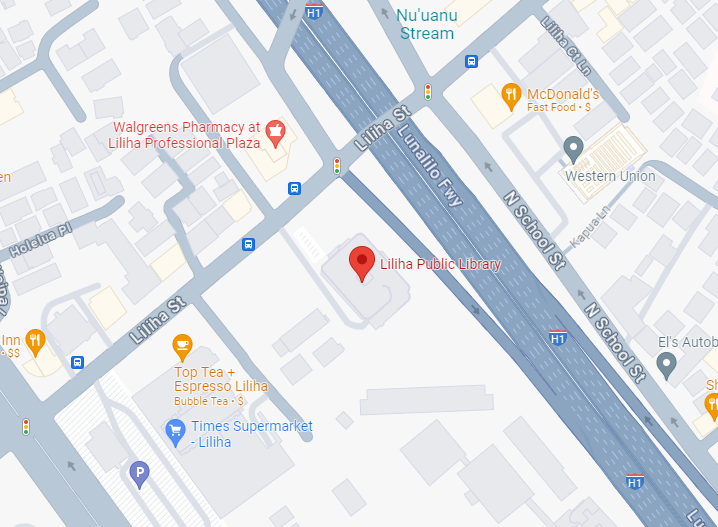

# Keyboards Hawaii 2024 Summer Meetup

## Location: Liliha Public Library - 1515 Liliha St, Honolulu, HI 96817

## Parking Instructions:

There is very limited (and free) parking available atop the public library. When facing the building, there will be a ramp on the right-side which will bring you to the roof where the parking stalls are.

Please note as we are sharing this space with others attending the library for non-keyboard activities, it is **highly recommended** to either park offsite and walk over or at the very least, carpool to the library. Liliha Square down the road by Times Supermarket has ample parking available as well.

## Disclosures:

The primary rules from the library are that there are no flames or alcohol on the premises. No soldering at this event folks!

Some people are also bringing some snacks to share with the attendees, you are free to bring some refreshments to share as well if you wish!

Keyboards Hawaii is not responsible for any trading/buying/selling activities that happen at this meetup. Any aforementioned transactions will be at your own discretion and risk.

And last but not least, please kokua and respect each other and their property :)
