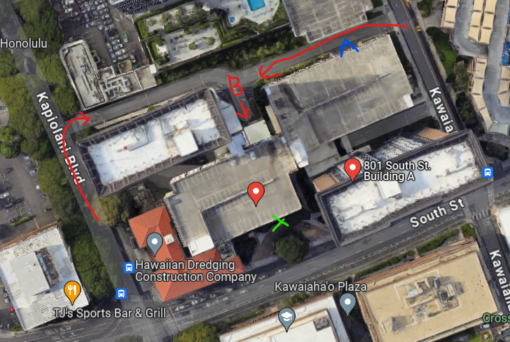

<!--  -->

Aloha! We are Keyboards Hawaii, a local group of custom keyboard enthusiasts primarily gathered around the island of Oahu.

Come chat with the community over at Discord @[dsc.gg/hikb](https://dsc.gg/hikb) or check us out on Instagram [@keyboardshawaii](https://www.instagram.com/keyboardshawaii/).

# Keyboards Hawaii - Winter 2024 Meetup

It's that time of year again for our winter meetup :sparkles:. This year it will be on **Saturday, November 30th from 8 AM - 2 PM.**

We will be hosting the meetup in **Meeting Room B of the apartment complex at [801 South Street, Honolulu, HI 96813](https://www.google.com/maps/place/801+South+St,+Honolulu,+HI+96813/@21.3027265,-157.8570346,19z/data=!3m1!4b1!4m6!3m5!1s0x7c006e0a3ec87477:0xf7e59aecfdbbc86a!8m2!3d21.3027265!4d-157.8563895!16s%2Fg%2F11c5n0qsfr?entry=ttu&g_ep=EgoyMDI0MTAwOS4wIKXMDSoASAFQAw%3D%3D)**. For those who came out the past few winters, yes it's the same location.

**Please see below for details regarding the location and parking instructions.**

If this is your first keyboard meetup, welcome! This is just a friendly meetup to hang out, eat some snacks, and show off your mechanical keyboard collection amongst other enthusiasts and newbies of the keyboard hobby. No, you do not need to have a keyboard to attend... but we do like to bring food to these events (potluck style, but not required), so come through! There will be giveaways too :eyes:.

To stay up to date on any additional announcements, this page will be updated accordingly. All announcements will be cross posted within our Discord and on our Instagram page as well.

Mahalo and hope to see you there!

### Meetup Etiquette and Additional Notes
 
 - Check for permission before handling any keyboards on display! We will be providing index cards to include this info for displays.
 - Remember to keep your hands clean before touching any displays and refrain from eating/drinking near them.
 - This is NOT a for-profit event. Attendance is free to the public.
 - Any sales/purchases/trades are at your own risk and discretion. Keyboards Hawaii is not responsible for these transactions.
 - Lastly, we do not own the venue. Please treat the premises with respect and clean up after yourselves. Thank you!

### Venue Details

If you are being dropped off, you can conveniently pull into the dropoff/pickup area right off of South St. Meeting Room B will be right in front of you.

People who want to use the parking structure, you will need to drive around to the back of the building to find **Garage B**. There is a back road that is connected to Kapiolani and Kawaiahao that leads to the garage. Pictures below for reference.

### Parking Instructions

1. Collect ticket from dispenser at gate entry of Garage B.
2. **DO NOT park on the first floor, those are reserved for residential guests.**
3. Park in stall numbers between 925-932, 979-985, 1001-1035 or 1044-1067.
4. Take note of your license plate and stall number.
5. Take the elevator to the ground level and sign in with security at the lobby.
6. **Alert the security officer that you are attending a meeting room event in Meeting Room B.**
7. A validation stamp will be provided that will allow you to exit the parking garage at no cost (up to 6 hours).
8. **Upon leaving, present the parking ticket to security.** Do not insert it in the ticket collection machine.
9. Thank you for coming!

